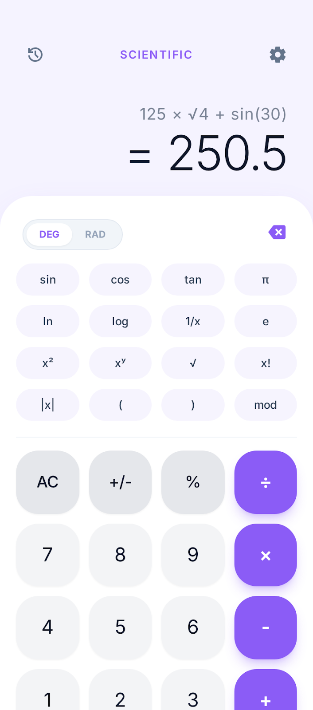
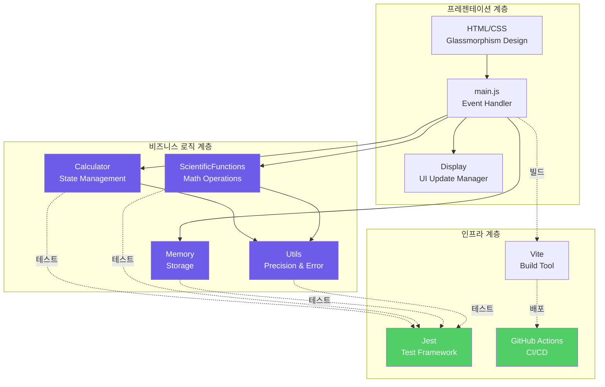
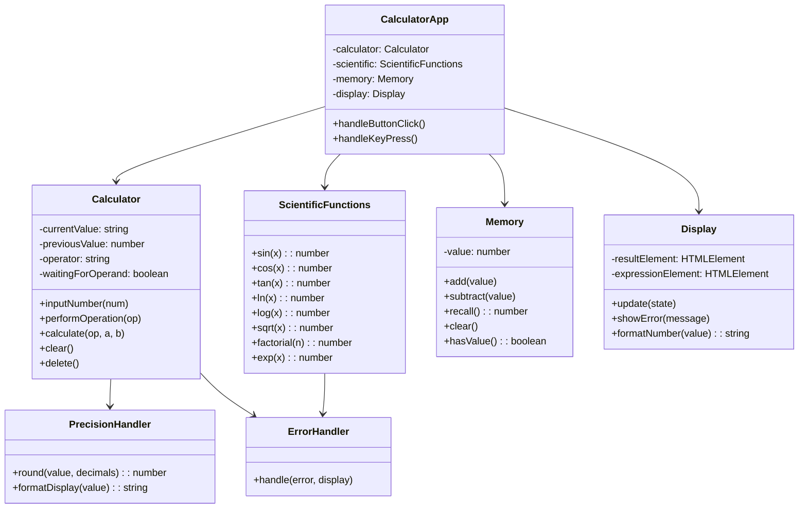
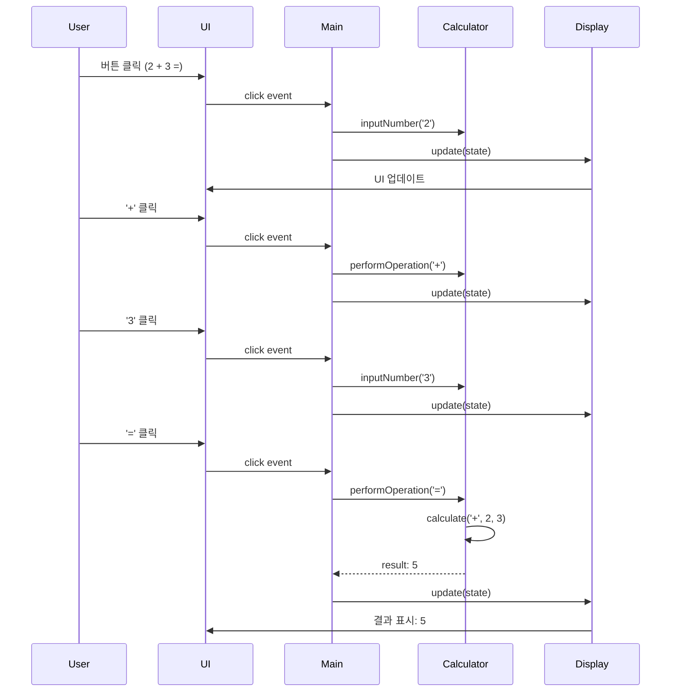
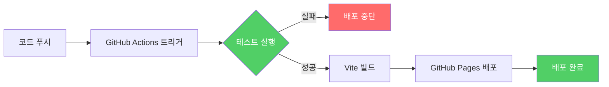
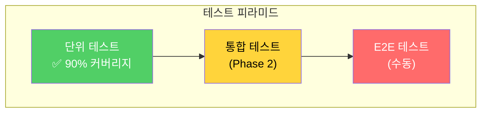

# 🧮 Scientific Calculator Web Application

> **Modern Engineering Calculator with TDD, SOLID Principles, and CI/CD**  
> *Production-ready web application demonstrating software engineering best practices*

[](https://ldw188918-hue.github.io/Calculator/)
[](https://github.com/ldw188918-hue/Calculator/actions)
[](LICENSE)

<div align="center">
  
</div>

---

## 📌 프로젝트 개요

**현대적인 UI/UX와 견고한 아키텍처를 가진 공학용 계산기 웹 애플리케이션**입니다. 
단순한 계산기 구현을 넘어, **실무급 소프트웨어 엔지니어링 원칙**을 적용하여 
확장 가능하고 유지보수가 용이한 코드베이스를 구축했습니다.

### 🎯 핵심 차별점

| 특징 | 설명 |
|------|------|
| 🧪 **TDD 기반 개발** | 코어 로직의 90% 이상 테스트 커버리지 달성 |
| 🏗️ **SOLID 원칙 준수** | 단일 책임, 개방-폐쇄 원칙 등 객체지향 설계 원칙 적용 |
| 🎨 **현대적 UI/UX** | 글래스모피즘 디자인, 반응형 레이아웃 |
| ⚡ **성능 최적화** | requestAnimationFrame, 메모이제이션 적용 |
| 🔄 **CI/CD 자동화** | GitHub Actions를 통한 자동 빌드 및 배포 |
| 📚 **체계적 문서화** | PRD, Tech Spec, 이슈 트래킹 완비 |

---

## 🏛️ 시스템 아키텍처

### 전체 아키텍처 다이어그램



### 클래스 다이어그램



### 데이터 흐름



---

## ✨ 주요 기능

### 기본 기능
- ✅ **산술 연산**: 덧셈, 뺄셈, 곱셈, 나눗셈, 퍼센트
- ✅ **과학 함수**: 삼각함수(sin, cos, tan), 로그(ln, log), 지수(e^x, 10^x)
- ✅ **고급 연산**: 제곱근, 거듭제곱, 팩토리얼
- ✅ **메모리 기능**: MC, MR, M+, M-
- ✅ **상수**: π, e
- ✅ **키보드 지원**: 숫자, 연산자, Enter, Escape, Backspace

### 기술적 특징

#### 1. 테스트 주도 개발 (TDD)
```javascript
// 예시: Calculator 테스트
describe('Calculator', () => {
  test('should add two numbers correctly', () => {
    const calc = new Calculator();
    calc.inputNumber('2');
    calc.performOperation('+');
    calc.inputNumber('3');
    calc.performOperation('=');
    expect(calc.currentValue).toBe('5');
  });
});
```

- **커버리지**: 코어 로직 90% 이상
- **테스트 프레임워크**: Jest + Babel
- **자동화**: GitHub Actions CI/CD 통합

#### 2. SOLID 원칙 적용

**단일 책임 원칙 (SRP)**
```javascript
// ❌ Bad: 하나의 클래스에 여러 책임
class Calculator {
  calculate() { /* ... */ }
  updateUI() { /* ... */ }  // UI 업데이트는 별도 책임
}

// ✅ Good: 책임 분리
class Calculator {
  calculate() { /* ... */ }  // 계산만 담당
}
class Display {
  update() { /* ... */ }  // UI 업데이트만 담당
}
```

**개방-폐쇄 원칙 (OCP)**
- 새로운 과학 함수 추가 시 기존 코드 수정 불필요
- 확장 가능한 구조 설계

**의존성 역전 원칙 (DIP)**
```javascript
// 의존성 주입 패턴
class CalculatorApp {
  constructor(calculator, display, memory) {
    this.calculator = calculator;  // 추상화에 의존
    this.display = display;
    this.memory = memory;
  }
}
```

#### 3. 성능 최적화

**requestAnimationFrame 활용**
```javascript
class Display {
  update(state) {
    if (this.updateScheduled) return;
    
    this.updateScheduled = true;
    requestAnimationFrame(() => {
      this.resultElement.textContent = state.currentValue;
      this.updateScheduled = false;
    });
  }
}
```

**메모이제이션**
```javascript
class MemoizedFunctions {
  factorial(n) {
    if (this.cache.has(`factorial_${n}`)) {
      return this.cache.get(`factorial_${n}`);
    }
    const result = this.calculateFactorial(n);
    this.cache.set(`factorial_${n}`, result);
    return result;
  }
}
```

#### 4. 에러 처리

```javascript
class ErrorHandler {
  handle(error, display) {
    let message;
    switch(error.message) {
      case 'Division by zero':
        message = 'Error: ÷ by 0';
        break;
      case 'Math domain error':
        message = 'Error: Domain';
        break;
      default:
        message = 'Error';
    }
    display.showError(message);
  }
}
```

---

## 🛠️ 기술 스택

### Frontend


- **HTML5**: 시맨틱 마크업, ARIA 접근성
- **CSS3**: CSS Variables, Flexbox/Grid, Glassmorphism
- **JavaScript ES6+**: 모듈 시스템, 클래스, async/await

### Build & Deploy


- **Vite**: 초고속 빌드 도구
- **GitHub Actions**: CI/CD 파이프라인
- **GitHub Pages**: 무료 호스팅

### Testing


- **Jest**: 단위 테스트 프레임워크
- **Babel**: ES6+ 트랜스파일링

---

## 📂 프로젝트 구조

```
Calculator/
├── .github/
│   └── workflows/
│       └── deploy.yml          # GitHub Actions CI/CD
├── assets/
│   └── design-reference.png    # 디자인 참고 이미지
├── css/
│   ├── reset.css              # CSS 리셋
│   ├── variables.css          # 디자인 토큰
│   ├── layout.css             # 레이아웃
│   └── components.css         # 컴포넌트 스타일
├── doc/
│   ├── prd.md                 # 제품 요구사항 문서
│   ├── tech_spec.md           # 기술 명세서
│   └── github_issues.md       # 이슈 템플릿
├── js/
│   ├── calculator.js          # 계산기 핵심 로직
│   ├── scientific.js          # 과학 함수
│   ├── memory.js              # 메모리 관리
│   ├── display.js             # UI 업데이트
│   ├── utils.js               # 유틸리티
│   └── main.js                # 엔트리 포인트
├── tests/
│   ├── calculator.test.js     # Calculator 테스트
│   ├── scientific.test.js     # Scientific 테스트
│   ├── memory.test.js         # Memory 테스트
│   └── utils.test.js          # Utils 테스트
├── .babelrc                   # Babel 설정
├── jest.config.js             # Jest 설정
├── vite.config.js             # Vite 설정
├── package.json               # 의존성 관리
└── index.html                 # 메인 HTML
```

---

## 🚀 시작하기

### 데모

🔗 **Live Demo**: [https://ldw188918-hue.github.io/Calculator/](https://ldw188918-hue.github.io/Calculator/)

### 로컬 실행

```bash
# 저장소 클론
git clone https://github.com/ldw188918-hue/Calculator.git
cd Calculator

# 의존성 설치
npm install

# 개발 서버 실행
npm run dev

# 브라우저에서 http://localhost:3000 접속
```

### 테스트 실행

```bash
# 모든 테스트 실행
npm test

# Watch 모드
npm run test:watch

# 커버리지 확인
npm run test:coverage
```

### 프로덕션 빌드

```bash
# 빌드
npm run build

# 빌드 결과 미리보기
npm run preview
```

---

## 🔄 CI/CD 파이프라인



### 자동화 워크플로우
1. **main 브랜치 푸시** 감지
2. **의존성 설치** (`npm ci`)
3. **테스트 실행** (`npm test`)
4. **빌드** (`npm run build`)
5. **GitHub Pages 배포**

---

## 🧪 테스트 전략

### 테스트 피라미드



### 테스트 대상

| 모듈 | 테스트 파일 | 커버리지 목표 |
|------|-------------|--------------|
| Calculator | `calculator.test.js` | 95% |
| ScientificFunctions | `scientific.test.js` | 100% |
| Memory | `memory.test.js` | 100% |
| Utils | `utils.test.js` | 100% |

---

## 📈 성능 메트릭

### Lighthouse 점수 (목표)

| 카테고리 | 점수 |
|----------|------|
| Performance | 90+ |
| Accessibility | 95+ |
| Best Practices | 100 |
| SEO | 100 |

### 최적화 기법
- ✅ requestAnimationFrame으로 리페인트 최적화
- ✅ 메모이제이션으로 중복 계산 방지
- ✅ 디바운싱으로 과도한 이벤트 처리 방지
- ✅ CSS 변수로 재사용성 향상
- ✅ 코드 스플리팅 (ES6 모듈)

---

## 📚 주요 학습 포인트

### 1. 소프트웨어 엔지니어링 원칙
- **TDD (Test-Driven Development)**: Red-Green-Refactor 사이클
- **SOLID 원칙**: 유지보수 가능한 객체지향 설계
- **클린 코드**: 가독성, 재사용성, 확장성

### 2. 실무 개발 프로세스
- **문서화**: PRD, Tech Spec 작성
- **이슈 관리**: GitHub Issues로 태스크 트래킹
- **버전 관리**: Git Flow, 의미있는 커밋 메시지

### 3. DevOps
- **CI/CD 구축**: GitHub Actions 파이프라인
- **자동화**: 테스트, 빌드, 배포 자동화
- **모니터링**: 빌드 상태 추적

### 4. 웹 성능 최적화
- **렌더링 최적화**: requestAnimationFrame
- **메모리 관리**: 메모이제이션, 가비지 컬렉션 고려
- **번들 최적화**: Vite를 통한 최적화된 빌드

---

## 🔮 향후 계획

### Phase 2 기능
- [ ] 계산 히스토리 저장 및 조회
- [ ] 각도 모드 전환 (DEG/RAD)
- [ ] 테마 변경 (라이트/다크 모드)
- [ ] 단위 변환기 통합
- [ ] PWA 전환 (오프라인 지원)

### 기술 개선
- [ ] TypeScript 마이그레이션
- [ ] React/Vue 리팩토링
- [ ] Web Workers를 통한 계산 오프로드
- [ ] IndexedDB를 통한 히스토리 저장

---

## 👨‍💻 개발자

**이동욱 (Donguk Lee)**  
Computer Science Student | Aspiring Software Engineer

- 📧 Email: ldw188918@gmail.com
- 💼 LinkedIn: [링크 추가]
- 🌐 Portfolio: [링크 추가]

---

## 📄 라이선스

이 프로젝트는 MIT 라이선스 하에 배포됩니다. 자세한 내용은 [LICENSE](LICENSE) 파일을 참조하세요.

---

## 🙏 감사의 말

이 프로젝트는 소프트웨어 엔지니어링 베스트 프랙티스를 학습하고 적용하기 위해 만들어졌습니다. 
실무에서 요구되는 코드 품질, 테스트, 문서화, CI/CD 등을 직접 경험하며 성장할 수 있었습니다.

---

<div align="center">
  <strong>⭐ 이 프로젝트가 도움이 되었다면 Star를 눌러주세요!</strong>
</div>
